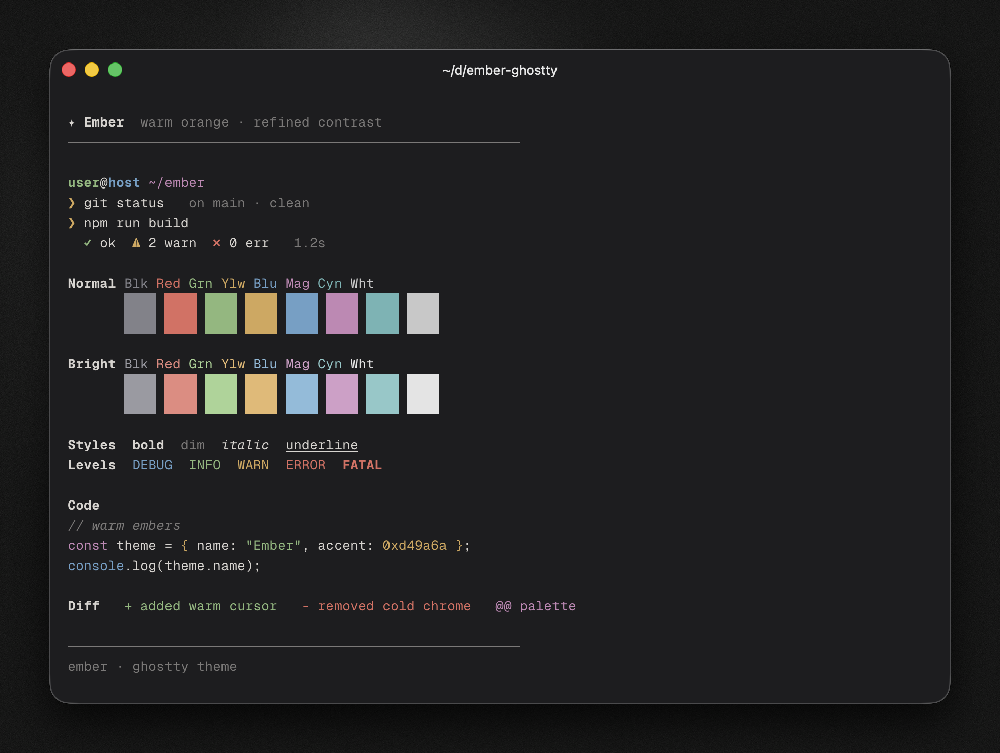
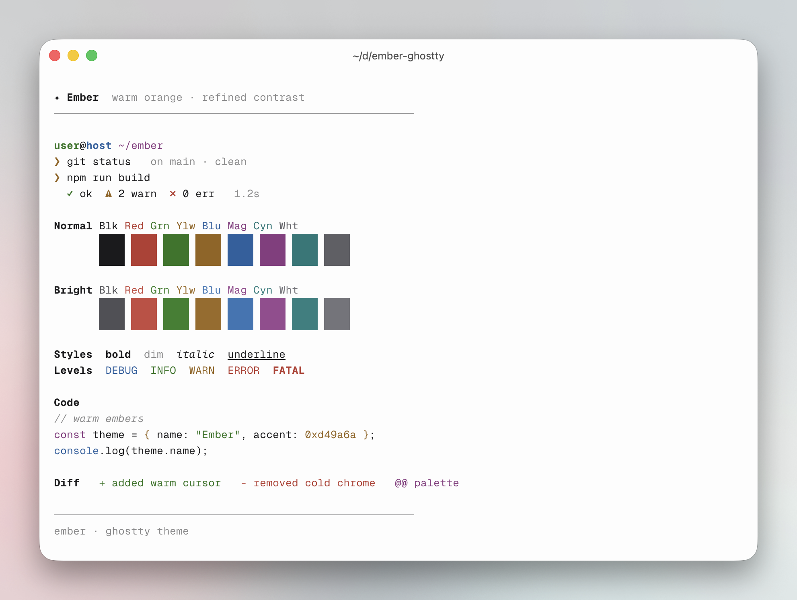

# Ember for [Ghostty](https://github.com/ghostty-org/ghostty)

A refined terminal theme with warm orange accents — dark and light variants designed for optimal readability and comfortable contrast.

<p align="center">
  
  
</p>

## Usage

### Direct / Manual install

1. Copy the theme files from [`themes/`](./themes/) into the `themes/` subdirectory of your [Ghostty configuration directory](https://ghostty.org/docs/config#file-location) (e.g. `~/.config/ghostty/themes/`):

   ```bash
   mkdir -p ~/.config/ghostty/themes
   cp "themes/Ember Dark" "themes/Ember Light" ~/.config/ghostty/themes/
   ```

2. Set the theme in your [Ghostty configuration file](https://ghostty.org/docs/config#file-location):

   ```
   # Single theme
   theme = Ember Dark
   # or
   theme = Ember Light

   # Auto light/dark (follows system appearance)
   theme = light:Ember Light,dark:Ember Dark
   ```

3. Reload or restart Ghostty.

> [!NOTE]
> For further theme configuration reference, see https://ghostty.org/docs/config/reference#theme.
